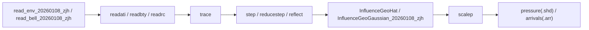

# Bellhop 射线追踪与声场计算过程文档

## 1. 文档目的与范围

本文面向当前仓库中的 MATLAB 版 `Bellhop` 实现，整理 `Bellhop` 求解声线路径与声压场的底层过程，并把核心公式、算法技巧、参数开关和代码模块逐一对应起来。文档同时给出两条并行主线：

1. 标准 `Bellhop` / 经典文献脉络  
   以 Porter & Bucker (1987)、Weinberg & Keenan (1996, GRAB)、Porter (2019) 为主。
2. 当前仓库 MATLAB 变体实现  
   以 `bellhopM_20260108_zjh.m` 为入口，解释当前代码与标准 Bellhop 的一致处和差异处。

本文覆盖以下 8 个问题：

1. 射线追踪底层公式与 Bellhop 模块对应。
2. Bellhop 解常微分方程时使用的技巧与代码对应。
3. 海面、海底边界处理方法与代码对应。
4. 射线完成后声场计算的底层公式与代码对应。
5. Bellhop 中几种波束公式、参数设置与代码对应。
6. 波束遇边界反射/透射时的处理方法与代码对应。
7. Bellhop 为加速所做的处理与代码对应。
8. 每部分给出文献来源与代码位置。

## 2. 主流程总览

当前仓库中，`Bellhop` 主流程由 `bellhopM_20260108_zjh.m` 驱动，其执行链可以概括为：



各模块职责如下：

| 模块 | 作用 |
|---|---|
| `read_env_20260108_zjh.m` | 读取环境、边界、接收网格、beam 配置 |
| `read_bell_20260108_zjh.m` | 解析 `RunType`、`Beam.Type`、`Nbeams`、步长、波束参数 |
| `readati.m` / `readbty.m` | 海面/海底离散、切向量、法向量、曲率计算 |
| `trace.m` | 单条 beam 的主追踪循环 |
| `step.m` | 单步推进中心射线、动态射线变量、走时、反射振幅 |
| `reducestep.m` | 为命中层界面或边界而自动缩步 |
| `reflect.m` | 边界反射、方向翻转、曲率修正、反射系数更新 |
| `InfluenceGeoHat.m` | 几何 hat 波束对接收网格的贡献 |
| `InfluenceGeoGaussian_20260108_zjh.m` | 几何 Gaussian 波束对接收网格的贡献 |
| `scalep.m` | 最终柱面扩展/线源缩放，得到压力场 |

主控入口见：

- `bellhopM_20260108_zjh.m:55-93`
- `bellhopM_20260108_zjh.m:131-201`

## 3. 射线追踪底层公式与模块对应

### 3.1 中心射线方程

Porter (2019) 给出二维 beam tracing 的中心射线方程：

\[
\frac{dr}{ds}=c\,\xi(s), \qquad \frac{d\xi}{ds}=-\frac{1}{c^2}\frac{\partial c}{\partial r}
\]
\[
\frac{dz}{ds}=c\,\zeta(s), \qquad \frac{d\zeta}{ds}=-\frac{1}{c^2}\frac{\partial c}{\partial z}
\]

其中：

- `s` 为弧长；
- `(r,z)` 为二维距离-深度坐标；
- `c(r,z)` 为声速；
- `(\xi,\zeta)` 是按 `1/c` 缩放后的射线切向量分量。

文献对应：

- Porter (2019) 式 (2)-(5)
- Rodríguez 的 Bellhop 手册 “Theoretical background”

当前代码中，这组变量由 `ray(I).x` 和 `ray(I).Tray` 表示：

- `ray(I).x = [r, z]`
- `ray(I).Tray = [\xi, \zeta]`

初始化见：

- `trace.m:25-31`

单步推进见：

- `step.m:24-25`
- `step.m:43-44`

代码与公式的直接对应关系是：

\[
\mathbf{x}_{k+1} = \mathbf{x}_k + h\, c\, \mathbf{Tray}
\]
\[
\mathbf{Tray}_{k+1} = \mathbf{Tray}_k - h\, \frac{\nabla c}{c^2}
\]

这里在当前仓库的二维实现里，`ssp.m` 返回的 `gradc = [\partial c/\partial r,\ \partial c/\partial z]`，但当前代码默认 `c_r = 0`，即主要面向深度变化 SSP：

- `ssp.m:44-58`

### 3.2 动态射线方程

高斯/几何波束需要额外求解动态射线方程。Porter (2019) 在二维下写为：

\[
\frac{dq}{ds}=c\,p, \qquad \frac{dp}{ds}=-\frac{c_{nn}}{c^2}q
\]

其中 `q(s)` 描述射线管张开程度，`p(s)` 描述曲率相关量；`c_{nn}` 是沿法向方向的二阶声速导数。

Porter (2019) 还给出：

\[
c_{nn}=c_{rr}\zeta^2 - 2 c_{rz}\xi \zeta + c_{zz}\xi^2
\]

这正是当前代码里的实现：

- `step.m:15-16`
- `step.m:33-35`

即：

```matlab
cnn0_csq0 = crr0 * Tray0(2)^2 - 2.0 * crz0 * Tray0(1) * Tray0(2) + czz0 * Tray0(1)^2;
```

然后用它推进 `p, q`：

- `step.m:26-27`
- `step.m:45-46`

与文献式完全一致：

\[
p_{k+1} = p_k - h \left(\frac{c_{nn}}{c^2}\right) q
\]
\[
q_{k+1} = q_k + h\, c\, p
\]

### 3.3 走时与复声速

文献中 beam 场的相位延迟写为：

\[
\tau(s)=\int_0^s \frac{ds'}{c(s')}
\]

见 Porter (2019) 式 (7)。当前代码在 `step.m` 中把它写成复走时，以便把介质衰减并入传播：

- `step.m:48-50`

```matlab
c0_cmplx = c0 + 1i * c0_imag;
c1_cmplx = c1 + 1i * c1_imag;
tau2 = tau0 + h * ( w0 / c0_cmplx + w1 / c1_cmplx );
```

复声速来自 `crci.m`，它把实声速与衰减量合并为 `c + i c_imag`：

- `crci.m:18-37`
- `crci.m:39-67`

### 3.4 初值与源角

源码用：

- `trace.m:27-31`

设置初值：

\[
\mathbf{Tray}(0)=\frac{(\cos\alpha,\ \sin\alpha)}{c(0)},\quad p(0)=1,\quad q(0)=0,\quad \tau(0)=0
\]

这与 Porter (2019) 对几何束的初值相一致，即：

\[
q(0)=0,\quad p(0)=1
\]

见 Porter (2019) 式 (15)。它意味着当前追踪主干是“几何波束框架”，之后再由不同 influence 模块决定束形函数是 hat 还是 Gaussian。

## 4. Bellhop 解常微分方程时使用的技巧

### 4.1 两阶段 modified polygon method

Rodríguez 手册指出：Bellhop 使用 “two-step polygon method” 积分射线与动态方程；Porter (2019) 也指出二维中心射线通常用二阶 Runge-Kutta 即可。

当前代码中，这个两阶段格式实现在 `step.m`：

- 第一阶段：半步预测  
  `step.m:11-27`
- 第二阶段：重新评估介质并加权修正  
  `step.m:29-50`

具体做法是：

1. 用当前点 `x0, Tray0, p0, q0` 先走一个半步；
2. 在半步点重新计算 `c, gradc, c_nn`；
3. 用加权组合 `w0, w1` 完成整步更新。

这比纯 Euler 更稳定，同时又比高阶 RK 更容易配合“命中边界/界面”的缩步策略。

### 4.2 自动缩步，使射线落在界面/边界上

Porter (2019) 明确指出，高阶方法虽然可用，但会增加“确保射线落在界面和边界上”的复杂度。当前 Bellhop 的核心技巧正是每一步先试走，再判断是否会穿越：

- SSP 层界面；
- 海面边界；
- 海底边界；
- 当前边界线段的左右端点。

对应代码：

- `reducestep.m:3-64`

其中关键逻辑是求出多个候选步长：

- `hLayer`: 命中 SSP 层界面；
- `hTop`: 命中海面；
- `hBot`: 命中海底；
- `h4`, `h5`: 命中当前边界线段的范围端点。

最后取最小值：

```matlab
h = min( [ h, hLayer, hTop, hBot, h4, h5 ] );
```

这使得 Bellhop 在几何上“正好落到”待处理位置，再交给 `trace/reflect` 处理。

### 4.3 小步长保护

为了避免边界附近反复缩步导致步长趋于零，代码加入了一个最小步长保护：

- `reducestep.m:67-69`

```matlab
if ( h < 1.0d-4 * deltas )
     h = 1.0d-5 * deltas;
end
```

这是一种数值鲁棒性技巧，避免无限循环或停滞。

### 4.4 穿越层界面时的 jump condition

Bellhop 不仅缩步到层界面，还在穿界后对动态变量 `p` 施加 jump condition：

- `step.m:54-61`

```matlab
if ( Layer ~= Layer0 )
   RN  = -Tray2( 1 )^2 / Tray2( 2 ) * ( gradc2( 2 ) - gradc0( 2 ) ) / c0;
   p2 = p2 + q2 * RN;
end
```

这里体现的是：声速梯度在层界面处发生跳变时，束的曲率变量需要修正。Porter (2019) 在讨论动态射线、界面和工程实现时强调了这类弱间断处理的重要性；当前代码则给出直接实现。

### 4.5 增量层搜索

`ssp.m` 没有每一步都全表查找深度层，而是根据上一层索引 `Layer` 增量搜索：

- `ssp.m:18-25`

这在长距离追踪中可以显著减少层定位成本。

## 5. 海面、海底边界处理与声线反射

### 5.1 边界的几何表示

Bellhop 首先把海面和海底离散成折线或曲线段：

- `readati.m` 处理海面
- `readbty.m` 处理海底

支持两种类型：

- `'L'`：piecewise-linear
- `'C'`：curvilinear

对应代码：

- `readati.m:21-37`
- `readbty.m:23-38`

读入离散点后，程序计算每段的切向量和外法向量：

- 海面：`readati.m:72-85`
- 海底：`readbty.m:73-86`

并在曲线模式下计算节点法向平均值与曲率：

- 海面：`readati.m:87-108`
- 海底：`readbty.m:88-109`

曲率实现为：

\[
\kappa = \frac{d\phi}{ds}
\]

代码中用相邻节点切向角差近似：

```matlab
phi = atan2( tNode(2,:), tNode(1,:) )';
kappa = diff(phi) ./ RLen
```

### 5.2 反射检测：signed distance crossing

`trace.m` 在每一步结束后，用边界法向量计算起点和终点到边界的有符号距离：

- `trace.m:108-116`

```matlab
DistBegTop = DBegTop * nTop(:,IsegTop);
DistEndTop = DEndTop * nTop(:,IsegTop);
```

若满足：

\[
DistBeg < 0,\quad DistEnd \ge 0
\]

则认为射线从水体内部穿出了边界，需要反射：

- 海面：`trace.m:118-134`
- 海底：`trace.m:136-152`

这个写法有两个优点：

1. 只捕捉“从内到外”的 crossing，避免重复触发；
2. 能同时适配平边界和变曲率边界。

### 5.3 曲线边界下的切线/法线插值

对 `'C'` 型曲线边界，Bellhop 并不直接用整段法向，而是在 crossing 位置对节点切线、法线做线性插值：

- 海面：`trace.m:121-128`
- 海底：`trace.m:139-146`

这比整段常法向近似更平滑，也更适合曲率修正。

### 5.4 反射后如何更新射线方向

反射在 `reflect.m` 中完成。先把射线切向量分解到边界切向和法向：

- `reflect.m:8-9`

\[
T_g = \mathbf{Tray}\cdot \mathbf{T}_{b}, \qquad T_h = \mathbf{Tray}\cdot \mathbf{N}_{b}
\]

然后按照镜面反射更新方向：

- `reflect.m:42-43`

\[
\mathbf{Tray}_{new} = \mathbf{Tray}_{old} - 2 T_h \mathbf{N}_{b}
\]

这就是经典的“法向分量翻转、切向分量保持”。

### 5.5 边界曲率与声速梯度修正

仅仅反转方向还不够。Müller (1984) 型修正告诉我们，边界反射会改变束的曲率，Bellhop 把这个影响写成 `RN`，并加到 `p` 上：

- `reflect.m:11-33`
- `reflect.m:45-46`

核心步骤是：

1. 计算声速梯度沿射线法向/切向的跳变项 `cnjump`, `csjump`；
2. 计算边界曲率修正项 `2*kappa/c^2/Th`；
3. 合成为 `RN`；
4. 更新

\[
p \leftarrow p + q\,RN
\]

这意味着边界不只改变路径，还改变后续波束扩展与聚焦行为。

### 5.6 海面、海底的物理边界条件

Bellhop 支持的边界条件由 `topbot.m` 读入：

- 真空 `V`
- 刚性 `R`
- 声-弹半空间 `A`
- 文件反射系数 `F`

代码：

- `topbot.m:17-33`
- `topbot.m:44-73`

反射时的振幅/相位更新在 `reflect.m:50-70`：

- `R`: 刚性边界，不改符号；
- `V`: 真空边界，`Rfa = -Rfa`，即相位翻转；
- `F`: 乘以文件反射系数；
- `A`: 用半空间阻抗关系计算反射系数。

半空间公式在代码中写成：

\[
R = \frac{\rho_{HS}\gamma_1 - \gamma_2}{\rho_{HS}\gamma_1 + \gamma_2}
\]

其中：

\[
\gamma_1 = \sqrt{-[(\omega/c)^2 - k_g^2]}, \qquad \gamma_2 = \sqrt{-[(\omega/c_{HS})^2 - k_g^2]}
\]

代码见：

- `reflect.m:59-70`

### 5.7 当前 MATLAB 版的一个边界实现注意点

`readrc.m` 的确能把 `.trc/.brc` 文件中的角度-幅值-相位表读入：

- `readrc.m:8-80`

但 `reflect.m` 的 `case 'F'` 分支直接用了 `rInt`、`phiInt`：

- `reflect.m:54-57`

而当前仓库中没有看到这两个量在该分支内部完成插值计算。因此从当前代码看，`F` 型文件反射系数分支很可能没有完整移植，至少需要进一步核对。

## 6. 声线完成后如何计算声场

### 6.1 基本场表达式

Porter (2019) 将 beam 场写为：

\[
P(s,n)=A(s)\,\phi(s,n)\,e^{-i\omega \tau(s)}
\]

其中：

- `A(s)` 是束振幅；
- `\phi(s,n)` 是横向束形函数；
- `\tau(s)` 是传播走时；
- `n` 是接收点到中心射线的法向距离。

当前代码中的实现位置是：

- `InfluenceGeoHat.m`
- `InfluenceGeoGaussian_20260108_zjh.m`

它们都先在每个 ray segment 上建立局部几何量：

- `tray`: 单位切向；
- `nray`: 单位法向；
- `s`: 接收点沿该段的投影坐标；
- `n`: 接收点到 ray 的法向距离。

代码见：

- `InfluenceGeoHat.m:60-80`
- `InfluenceGeoGaussian_20260108_zjh.m:64-84`

### 6.2 接收点局部坐标计算

当前代码把接收点投影到 beam 段上：

\[
s = (\mathbf{x}_{rcvr}-\mathbf{x}_{ray}) \cdot \mathbf{t}_{ray}^{scaled}
\]
\[
n = \left|(\mathbf{x}_{rcvr}-\mathbf{x}_{ray}) \cdot \mathbf{n}_{ray}\right|
\]

对应代码：

- `InfluenceGeoHat.m:77-78`
- `InfluenceGeoGaussian_20260108_zjh.m:81-82`

然后对 `q` 和 `tau` 做线性插值：

- `InfluenceGeoHat.m:80-87`
- `InfluenceGeoGaussian_20260108_zjh.m:84-99`

这正是文献中把 beam 场从中心射线延拓到 ray 邻域的离散实现。

### 6.3 相干、非相干、到达结构

Bellhop 在当前实现中支持：

- 相干 TL：`RunType(1) == 'C'`
- 非相干/半相干 TL：`RunType(1) != 'C'` 且非 `A/E`
- 到达结构：`RunType(1) == 'A'`

相干叠加写为：

\[
U \leftarrow U + amp \, e^{-i\omega delay}
\]

见：

- `InfluenceGeoHat.m:110-112`
- `InfluenceGeoGaussian_20260108_zjh.m:122-124`

到达结构则把 `amp, delay, angle` 写入 arrival 表：

- `InfluenceGeoHat.m:106-108`
- `InfluenceGeoGaussian_20260108_zjh.m:118-120`
- `AddArr.m`

非相干/半相干分支则先把贡献转成能量型量再累加：

- `InfluenceGeoHat.m:114-117`
- `InfluenceGeoGaussian_20260108_zjh.m:126-129`

### 6.4 最终缩放：柱面扩展/线源

在 beam influence 累加结束后，`scalep.m` 再完成最终缩放。

对点源，代码使用：

\[
factor \propto \frac{1}{\sqrt{r}}
\]

对应柱面扩展；对线源则使用不同常数：

- `scalep.m:47-59`

同时：

- 几何/笛卡尔波束时 `const = -Dalpha * sqrt(freq) / c`
- 非相干时先对累积强度开方恢复为压力幅值

代码见：

- `scalep.m:6-13`
- `scalep.m:41-43`

## 7. Bellhop 中几种波束公式、参数设置与模块对应

### 7.1 文献中的三类主要波束

Porter (2019) 将二维 Bellhop 中常见波束分为：

1. **Paraxial Beam Tracing (PBT)**  
   束形：
   \[
   \phi(s,n)=\exp\left[-\frac{i\omega}{2}\frac{p(s)}{q(s)}n^2\right]
   \]
   见式 (8)。

2. **Geometric hat beam**  
   初值：
   \[
   q(0)=0,\quad p(0)=1
   \]
   宽度：
   \[
   W(s)=\left|\frac{q(s)\,d\alpha}{c(0)}\right|
   \]
   束形是分片线性 hat 函数。见式 (15)-(18)。

3. **Geometric Gaussian beam**  
   束形：
   \[
   \phi(s,n)=\exp\left[-\frac12 \left(\frac{n}{W(s)}\right)^2 \right]
   \]
   幅值比 hat 束多一个 `1/sqrt(2pi)` 的归一化因子。见式 (21)-(23)。

Weinberg & Keenan (1996) 的 GRAB 属于几何 Gaussian ray bundles 路线，其特征是：

- 用 Gaussian bundle 表示 ray tube；
- 不显式采用经典复 `p-q` paraxial 初值来发射束；
- 对 caustic 附近束宽加入下限，也就是 Porter (2019) 所说的 “stent”。

### 7.2 当前代码中的实际 beam 选择

`read_bell_20260108_zjh.m` 解析 `RunType(2)`：

- `'C'`: Cartesian beams
- `'R'`: Ray-centered beams
- `'S'`: Simple gaussian beams
- `'B'`: Geometric gaussian beams
- 其他：默认 `'G'`，打印 “Geometric hat beams”

见：

- `read_bell_20260108_zjh.m:55-67`

但在当前 MATLAB 版主程序中，实际调用是：

- `RunType(2) == 'G'` 时走 `InfluenceGeoHat.m`
- 否则走 `InfluenceGeoGaussian_20260108_zjh.m`

代码：

- `bellhopM_20260108_zjh.m:185-188`

因此当前仓库里存在一个需要特别说明的实现差异：

> 名义上的 `'G'` 实际映射到了 hat beam influence，而其他二字符选项映射到 Gaussian influence。

这和名字的直觉关系并不完全一致，写文档或做复现实验时必须单独标注。

### 7.3 几何 hat beam 在代码中的实现

在 `InfluenceGeoHat.m` 中：

- 参考宽度：
  \[
  q_0 = \frac{c(0)}{D\alpha}
  \]
  见 `InfluenceGeoHat.m:17-18`

- 波束半宽：
  \[
  RadMax = \left|\frac{q}{q_0}\right|
  \]
  见 `InfluenceGeoHat.m:80-83`

- 仅当 `n < RadMax` 时接收点才受该 beam 影响：
  `InfluenceGeoHat.m:83`

- hat 束形：
  \[
  W = \frac{RadMax - n}{RadMax}
  \]
  见 `InfluenceGeoHat.m:115`

- 幅值：
  \[
  amp \propto \sqrt{\frac{c}{|q|}} \cdot A \cdot (RadMax - n)
  \]
  见 `InfluenceGeoHat.m:95-100`

这就是 Porter (2019) 几何 hat 束的离散实现。

### 7.4 几何 Gaussian beam 在代码中的实现

在 `InfluenceGeoGaussian_20260108_zjh.m` 中：

- 参考宽度同样使用
  \[
  q_0 = \frac{c(0)}{D\alpha}
  \]
  见 `InfluenceGeoGaussian_20260108_zjh.m:19-20`

- 束宽：
  \[
  \sigma = \left|\frac{q}{q_0}\right|
  \]
  见 `InfluenceGeoGaussian_20260108_zjh.m:84-86`

- Gaussian 衰减：
  \[
  \exp\left[-\frac12 \left(\frac{n}{\sigma}\right)^2 \right]
  \]
  见 `InfluenceGeoGaussian_20260108_zjh.m:112`

- 幅值中包含 `1/sqrt(2pi)`：
  `InfluenceGeoGaussian_20260108_zjh.m:25-29`

这与 Porter (2019) 式 (21)-(23) 对应。

### 7.5 GRAB/几何 Gaussian 的束宽下限

Porter (2019) 在回顾 GRAB 时指出，Weinberg & Keenan 的重要技巧是在 caustic 附近对最小束宽设置下限，即 “stent”。

当前仓库的 `InfluenceGeoGaussian_20260108_zjh.m` 也做了类似处理，不过它显式修改了旧版本参数：

- 旧版本：
  `InfluenceGeoGaussian.m:89-90`
- 当前版本：
  `InfluenceGeoGaussian_20260108_zjh.m:91-92`

当前版本把最小束宽设置为：

\[
\sigma_{min} = \min\left(2\,freq\,\tau,\ 2\pi\lambda\right)
\]

并强制：

\[
\sigma \leftarrow \max(\sigma,\ \sigma_{min})
\]

这属于典型的 GRAB 风格“束宽支撑/下限保护”，目的是避免 caustic 处宽度趋零引发奇异与数值噪声。

### 7.6 其他 beam 参数开关

`read_bell_20260108_zjh.m` 还支持：

- `Beam.Type`
- `epmult`
- `rLoop`
- `Nimage`
- `Ibwin`
- `RunType(4) = 'R'/'X'`，点源或线源

对应代码：

- `read_bell_20260108_zjh.m:126-178`
- `read_bell_20260108_zjh.m:184-191`

结合 Rodríguez 手册的 near-source 示例，可作如下理解：

| 参数 | 含义 | 代码位置 |
|---|---|---|
| `Beam.Type(1)` | Min/Fill/Cer 等 beam 组织方式的入口 | `read_bell_20260108_zjh.m:148-152` |
| `Beam.Type(2)` | 曲率条件：标准/加倍/清零 | `read_bell_20260108_zjh.m:154-164` |
| `epmult` | 初始 beam 参数的倍率系数 | `read_bell_20260108_zjh.m:150,166` |
| `rLoop` | 用于选择 beam width 的参考距离 | `read_bell_20260108_zjh.m:151,167` |
| `Nimage` | 镜像/近场修正相关参数 | `read_bell_20260108_zjh.m:172,175` |
| `Ibwin` | beam windowing 参数 | `read_bell_20260108_zjh.m:173,176` |
| `RunType(4)` | 点源 `R` 或线源 `X` | `read_bell_20260108_zjh.m:184-191` |

当前 MATLAB 版中，`Beam.Type(2)` 在 `reflect.m` 中明确影响边界曲率修正：

- `'D'`: 曲率修正加倍  
  `reflect.m:35-37`
- `'Z'`: 曲率修正清零  
  `reflect.m:38-39`

## 8. 波束遇边界反射和透射时，怎么处理

### 8.1 射线阶段先累积边界效应

Bellhop 当前实现采用“先在射线阶段更新，再在场阶段使用”的结构：

1. `trace/reflect` 修改 `Tray, p, Rfa`
2. `Influence*` 只读取已经更新过的 `ray(is)` 状态

因此，边界反射对场的影响不是在 `Influence*` 里重新求一次，而是通过沿途累积的：

- `Rfa`: 振幅/相位
- `p`: 束曲率
- `Tray`: 路径方向
- `tau`: 复走时

共同体现。

### 8.2 反射相位与振幅

边界反射后，`Rfa` 的更新规则如下：

- 真空边界：`Rfa = -Rfa`
- 文件反射系数：`Rfa = Rfa * rInt * exp(i phiInt)`
- 半空间：`Rfa = Refl * Rfa`

见：

- `reflect.m:50-70`

而 `Influence*` 中的场幅值都直接乘上 `ray(is).Rfa`：

- `InfluenceGeoHat.m:95`
- `InfluenceGeoGaussian_20260108_zjh.m:106`

因此边界相位会直接传递到最终相干和。

### 8.3 曲率修正如何进入束形

边界反射后的束形变化不是在 `Influence*` 里单独处理，而是通过：

\[
p \leftarrow p + q\,RN
\]

先改写动态变量，再在后续传播中影响：

- `q(s)` 的演化；
- 束宽 `RadMax` / `sigma`；
- 振幅中的 `sqrt(c/|q|)`；
- caustic 相位切换。

所以边界对 beam 的影响既包括“反射系数”，也包括“束管几何重新组织”。

### 8.4 透射在当前 Bellhop 里的体现

对于你关心的“透射”，当前二维 Bellhop 代码并没有像全波模型那样显式生成一个独立 transmitted beam 分支。它主要通过两个层面体现：

1. **SSP 层界面 jump condition**  
   即 `step.m:54-61` 中的 `p` 修正。
2. **半空间边界反射系数模型**  
   即 `reflect.m:58-70` 中的阻抗/衰减效应。

因此，在当前实现语境下更准确的说法是：

> Bellhop 对边界主要做“反射主导”的 beam tracing；对透射效应的体现主要是通过复声速、层界面梯度跳变、以及半空间反射系数的能量泄漏来间接进入，而不是显式追踪独立透射束。

## 9. Bellhop 为提高计算速度所做的处理

### 9.1 自动推荐 beam 数

若输入 `Nbeams == 0`，代码自动按频率、最大距离和水深估计 beam 数：

- `read_bell_20260108_zjh.m:73-77`

当前变体实现：

\[
Nbeams = \max\left(\left\lceil 0.3 \cdot 1000 \cdot R_{max}\cdot \frac{freq}{c_0}\right\rceil,\ 300\right)
\]

然后又结合一个经验发射角分辨率做二次约束。这能减少用户手调成本，也避免 beam 过少造成漏采样。

### 9.2 预分配大数组

主程序在追踪前预分配：

- `ray`
- `Arr`
- `pressure`

代码：

- `bellhopM_20260108_zjh.m:95-117`

这避免了 MATLAB 中频繁扩容的开销。

### 9.3 使用均匀接收距离网格快速 bracket

`Influence*` 假设接收距离网格均匀，从而能用简单的 `ceil/floor` 快速找出本段射线跨越了哪些接收距离：

- `InfluenceGeoHat.m:37-50`
- `InfluenceGeoGaussian_20260108_zjh.m:41-55`

这样就不需要对每个接收距离逐一做几何搜索。

### 9.4 只对局部有效接收深度累加

在接收深度方向，Bellhop 并不是把每条 beam 累加到整列水深，而是只取满足：

- hat 束：`n < RadMax`
- Gaussian 束：`n < IBWin * sigma`

的接收点。

代码：

- `InfluenceGeoHat.m:83`
- `InfluenceGeoGaussian_20260108_zjh.m:94`

这属于局部支撑/窗口剪枝，是 Bellhop 比全局网格法快得多的关键原因之一。

### 9.5 不做全局 eigenray 搜索，而做逐段影响累计

Porter (2019) 强调 beam tracing 的一个重要优势是“不需要精确寻找 eigenray”。当前 Bellhop 代码中也体现为：

- 先追踪 beam；
- 再沿 beam 段把其 influence 投影到接收网格上；
- 相干叠加即可。

对应模块：

- `trace.m`
- `InfluenceGeoHat.m`
- `InfluenceGeoGaussian_20260108_zjh.m`

这是相对于传统 eigenray 搜索的一种重要加速。

### 9.6 增量层搜索与边界缩步

`ssp.m` 的层增量搜索和 `reducestep.m` 的缩步虽然主要是鲁棒性技巧，但实际上也减少了：

- 穿界后的回退/修补；
- 每步的全局查找；
- 几何误差导致的重复边界判定。

对应代码：

- `ssp.m:18-25`
- `reducestep.m:3-68`

### 9.7 当前变体对 Gaussian 最小束宽的修改

当前仓库把旧版 Gaussian 束宽下限：

\[
\min(0.2\,freq\,\tau/\lambda,\ \pi\lambda)
\]

改成了：

\[
\min(2\,freq\,\tau,\ 2\pi\lambda)
\]

位置：

- 旧版：`InfluenceGeoGaussian.m:89-90`
- 当前版：`InfluenceGeoGaussian_20260108_zjh.m:91-92`

这是一个典型的工程折中：

- 宽度下限更大，caustic 附近更稳定；
- 能减少极窄 Gaussian 导致的高频振荡和局部噪声；
- 通常也会提高数值效率，因为有效窗口更平滑。

## 10. 标准 Bellhop 与当前 MATLAB 变体的关系总结

### 10.1 一致之处

当前仓库与标准 Bellhop 一致的核心骨架包括：

- 2D 射线方程；
- `p-q` 动态射线方程；
- 二阶 polygon / RK2 风格积分；
- 自动缩步命中边界/界面；
- 海面/海底切线、法线、曲率处理；
- 用 beam influence 代替精确 eigenray 搜索；
- 最终按柱面扩展恢复压力场。

### 10.2 当前 MATLAB 变体的显著差异

当前仓库相对标准 Bellhop 文献/手册，有几处应在使用时特别注意：

1. `RunType(2)=='G'` 实际调用的是 `InfluenceGeoHat.m`。  
2. `InfluenceGeoGaussian_20260108_zjh.m` 修改了最小束宽公式。  
3. `reflect.m` 中 `F` 型文件反射系数分支看起来缺少 `rInt/phiInt` 的本地插值计算。  
4. `ssp.m` 当前默认 `c_r = c_{rz} = c_{rr} = 0`，更偏向二维、深度依赖 SSP 的场景。  
5. `Bellhop(M)` 版本采用 MATLAB 结构体数组存 beam 轨迹，和原 Fortran 版的内存布局不同，但数学结构一致。

## 11. “需求项 -> 文献 -> 模块 -> 代码位置 -> 备注”总表

| 需求项 | 文献依据 | Bellhop 模块 | 代码位置 | 当前仓库备注 |
|---|---|---|---|---|
| 1. 射线追踪底层公式 | Porter (2019) 式 (2)-(5), (10)-(11) | `trace`, `step`, `ssp` | `trace.m:25-31,73-76`; `step.m:13-16,24-27,31-46`; `ssp.m:27-58` | 使用 `x, Tray, p, q, tau, Rfa` 状态量 |
| 2. ODE 求解技巧 | Porter (2019) 关于 2nd-order RK；Rodríguez “two-step polygon method” | `step`, `reducestep`, `ssp` | `step.m:11-50,54-61`; `reducestep.m:3-68`; `ssp.m:18-25` | 含缩步、jump condition、小步长保护 |
| 3. 海面海底处理 | Porter (2019) 关于 interfaces；Müller (1984) 曲率修正 | `readati`, `readbty`, `trace`, `reflect`, `readrc`, `topbot` | `readati.m:72-108`; `readbty.m:73-109`; `trace.m:104-152`; `reflect.m:8-70`; `readrc.m:8-80`; `topbot.m:17-73` | `F` 型文件反射分支疑似未完整移植 |
| 4. 声场底层公式 | Porter (2019) 式 (6)-(7) | `InfluenceGeoHat`, `InfluenceGeoGaussian_20260108_zjh`, `scalep` | `InfluenceGeoHat.m:70-117`; `InfluenceGeoGaussian_20260108_zjh.m:74-129`; `scalep.m:6-59` | 先累积 beam influence，再统一缩放 |
| 5. 几种波束公式与参数 | Porter (2019) 式 (8)-(23)；Weinberg & Keenan (1996) | `read_bell_20260108_zjh`, `InfluenceGeoHat`, `InfluenceGeoGaussian_20260108_zjh`, `scalep` | `read_bell_20260108_zjh.m:55-67,126-191`; `InfluenceGeoHat.m:17-25,80-117`; `InfluenceGeoGaussian_20260108_zjh.m:19-29,84-129`; `scalep.m:6-13,47-59` | `RunType(2)` 与实际 influence 模块映射需单独说明 |
| 6. 边界反射/透射后的场处理 | Porter (2019)；半空间反射系数标准写法 | `reflect`, `InfluenceGeoHat`, `InfluenceGeoGaussian_20260108_zjh`, `step` | `reflect.m:50-70`; `InfluenceGeoHat.m:95`; `InfluenceGeoGaussian_20260108_zjh.m:106`; `step.m:54-61` | 透射主要体现在 jump condition 和复声速，不是显式 transmitted beam |
| 7. 加速技巧 | Porter (2019) 关于 beam tracing 避免 eigenray 搜索；Bellhop 手册 | `bellhopM_20260108_zjh`, `read_bell_20260108_zjh`, `ssp`, `Influence*`, `reducestep` | `bellhopM_20260108_zjh.m:95-117,137-145`; `read_bell_20260108_zjh.m:73-77`; `ssp.m:18-25`; `InfluenceGeoGaussian_20260108_zjh.m:41-55,91-97`; `InfluenceGeoHat.m:37-50,83-86`; `reducestep.m:3-68` | 当前版额外调整了 Gaussian 束宽下限 |
| 8. 文献参考对应 | 见下节 | 全文 | 全文 | 已按章节给出对应 |

## 12. 参考文献与在线来源

1. Michael B. Porter and Homer P. Bucker, “Gaussian beam tracing for computing ocean acoustic fields,” *J. Acoust. Soc. Am.* 82(4), 1349-1359 (1987). DOI: [10.1121/1.395269](https://doi.org/10.1121/1.395269)  
   补充可访问条目：[CiNii 摘要页](https://cir.nii.ac.jp/crid/1364233269119729664)

2. Henry Weinberg and Ruth E. Keenan, “Gaussian ray bundles for modeling high-frequency propagation loss under shallow-water conditions,” *J. Acoust. Soc. Am.* 100(3), 1421-1431 (1996). DOI: [10.1121/1.415989](https://doi.org/10.1121/1.415989)

3. Michael B. Porter, “Beam tracing for two- and three-dimensional problems in ocean acoustics,” *J. Acoust. Soc. Am.* 146(3), 2016-2029 (2019). DOI: [10.1121/1.5125262](https://doi.org/10.1121/1.5125262)  
   开放 PDF: [HLS Research](https://hlsresearch.com/personnel/porter/papers/JASA/3D%20SI%20Beam%20tracing.pdf)

4. Orlando Camargo Rodríguez, “General description of the BELLHOP ray tracing program” (2008).  
   在线手册首页：[manual](https://www.siplab.fct.ualg.pt/models/bellhop/manual/manual.html)  
   Theoretical background: [node3](https://www.siplab.fct.ualg.pt/models/bellhop/manual/node3.html)  
   Numerical issues: [node5](https://www.siplab.fct.ualg.pt/models/bellhop/manual/node5.html)  
   Near source fields / beam options: [node12](https://www.siplab.fct.ualg.pt/models/bellhop/manual/node12.html)

5. 本地文献：
   - `Porter 和 Bucker - 1987 - Gaussian beam tracing for computing ocean acoustic.pdf`
   - `Weinberg - Gaussian ray bundles for modeling high-frequency p.pdf`
   - `Porter - 2019 - Beam tracing for two- and three-dimensional problems in ocean acoustics.pdf`
   - `GRAB算法实现_赵宁.pdf`

## 13. 结论

从当前仓库实现看，Bellhop 的计算逻辑可以概括为：

1. 用中心射线方程和动态射线方程追踪每一条 beam。
2. 用 `modified polygon method + 自动缩步 + jump condition` 保证数值稳定和边界几何一致性。
3. 用切线/法线/曲率描述海面海底，并在反射时同时更新路径、束曲率和反射振幅。
4. 用几何 hat 或 Gaussian influence 把每条 beam 的局部场投影到接收网格。
5. 对所有 beam 的贡献做相干或非相干叠加，再乘柱面扩展因子得到最终声压场。

如果后续你希望，我可以继续在这份文档基础上再补两类内容：

1. 把每个公式都改写成“变量名完全跟代码一致”的版本。  
2. 按你的本地 PDF 页码继续补“文献页码级引用”，做成更适合论文/报告直接引用的版本。
